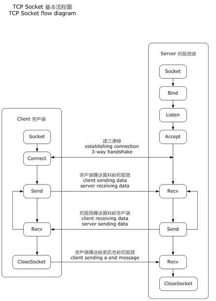

# HTTPServer
Project meant to study more about HTTP Servers. The final objective of this study is to be able to create a HTTP Server with an API that downloads a file in some directory of the server. Till that, there will be other simpler side projects described in the next topics:
<br /><br />

### General requirements
All the projects will be python scripts, then the general requirements is to have it installed. By running the next commands in a Linux terminal, you'll be able to run the scripts. The version installed will be 3.8:

    sudo sudo apt update
    sudo apt install software-properties-common
    sudo add-apt-repository ppa:deadsnakes/ppa
    sudo apt install python3.8

To ensure that Python was correctly installed, run:

    python3 --version

The output should be like this:

    Python 3.8.10

When any of the servers is running, you should only have an client to establish connection with it, for example your prefered browser. The host and port configured on the projects will be 

    localhost:8080
<br />

## FrameworkHTTPServer.py
This POC uses a framework that does the job that I want to achieve using the socket library.
### Extra Requirements

Python pip: Used as the standard package manager for Python, it is an requirement to download the Tornado Framework:

    sudo apt install python3-pip

Tornado: Tornado framework is a web framework and asynchronous networking library. To install it, run the command:

    pip install tornado

### Usage
To start the application, run the following command from inside the HTTPServer directory:

    python3 FileDownloader.py

You should insert the file in the HTTPServer directory, and the client will download it when it accesses the following URI, changing the file_name to the name of the file with its extension.
```
localhost:8080/<file_name>
```
If you don't want to put any other files in the repository, you can give it a try by downloading this README file!
```
localhost:8080/README.md
```
<br />

## HelloWorldServer.py
This POC starts the using of the library socket. Now it will be able to establish the TCP connection between the server and the client. The client will only receive an Hello World message, and you can try it by running the script and accessing your browser at the correct host and port

    python3  HelloWorldServer.py


## Client-Server
This POC resumes the behavior of the server and the client when a connection is established and a communication happens. Both codes represents what happening in this image



To run it, first execute the Server.py, it will stop at the Accept step, with a socket on Listen status on the server-side. It will block until the client connects to it, creating a new socket in server-side in status Established peered with corresponding socket on client-side. To create that connection, you can run the Client.py code.